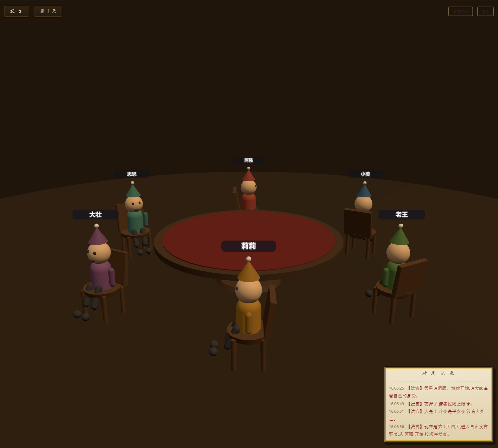

# 🐺 AI 狼人杀

> 你与 AI 玩家围坐 3D 圆桌的狼人杀。AI 角色由 **DeepSeek 大模型**驱动——发言、投票、夜晚行动、自由插话;台词由**讯飞云端语音**逐条朗读;复古桌游风界面。**纯前端实现,无后端服务器**。

<!-- 截图占位:运行后截图放到 docs/screenshots/ 并替换下面的路径 -->


## ✨ 特性

| | |
|---|---|
| 🎭 **3D 圆桌场景** | 程序化卡通小人围桌而坐,说话时嘴部开合、名牌高亮;死亡倒伏、放逐下沉;镜头自由旋转缩放 |
| 🧠 **千人千面的 AI** | 每个座位有固定人设(12 种性格 + 口头禅 + 说话风格),发言各不相同,不套模板、不复读 |
| 🔒 **角色保密** | 预言家查验记录等私密信息只进 AI 上下文,UI 层接触不到 |
| 🗣️ **语音朗读** | 讯飞流式合成;法官播报与角色发言**严格串行**,一人读完再读下一个;可一键跳过 |
| 🎤 **真人扮演** | 白天打字发言(可选朗读);夜晚能力者(狼/预言家/女巫/守卫/猎人)弹窗选择行动目标 |
| 👁️ **观战模式** | 全 AI 自动对局,适合演示、挂机测试 |
| ✋ **自由插话** | 别人发言时 AI 后台判定"是否想插话",举手打断(可开关) |
| 🛡️ **稳定可靠** | LLM 指数退避重试 + 全局并发闸门防限流 + JSON 解析容错降级,AI 挂了游戏不崩 |
| 🎨 **复古桌游风 UI** | 木纹、羊皮纸、硬阴影按钮,纹理全部 CSS 生成,零外部图片与字体 |

## 🚀 快速开始

```bash
npm install
npm run dev        # 打开 http://localhost:5173(端口被占用会自动顺延)
```

不配置任何 Key 也能玩:AI 退化为随机决策的"笨 AI"、无声,适合先看 3D 场景和流程。要完整体验,需注册两个平台(各约 5 分钟,**详见 [docs/GUIDE.md](docs/GUIDE.md) 分步教程**):

1. **DeepSeek**(驱动 AI 大脑):[platform.deepseek.com](https://platform.deepseek.com) 创建 API Key,充值几元(一局成本约几分钱)
2. **讯飞开放平台**(语音朗读):[www.xfyun.cn](https://www.xfyun.cn) 创建「语音合成(流式版)」应用,取 AppID / APIKey / APISecret

在设置页填入即可,自带「测试连接 / 测试发音」按钮。

```bash
npm test           # 引擎测试(含 20 局不死锁验收)
npm run build      # 类型检查 + 生产构建
```

## 🧩 玩法

- **对局设置**:6 / 9 / 12 人预设或自定义角色配比;选择你的座位;可勾选观战模式、快速模式(不朗读)、死者遗言、AI 自由插话
- **夜晚**:能力者弹窗行动(狼刀 / 查验 / 守护 / 救毒),平民"闭眼"等待,法官播报推进节奏
- **白天**:按顺序轮流发言;AI 发言会引用历史、互相怀疑、带个人风格;投票放逐,平票无人出局
- **角色**:村民 · 预言家 · 女巫 · 猎人 · 守卫 · 狼人(狼人互知队友,每晚各自提名多数票定刀口)
- **胜负**:狼人全灭 = 好人胜;存活狼数 ≥ 好人数 = 狼胜

## 🛠️ 技术栈

- **框架**:Vue 3 + TypeScript + Vite + Pinia
- **3D**:Three.js(OrbitControls,程序化几何体角色,预留 VRoid/VRM 接口)
- **AI**:DeepSeek chat completions(OpenAI 兼容,浏览器直连,`deepseek-flash` 模型)
- **语音**:讯飞流式 WebSocket(浏览器端 HMAC-SHA256 签名,PCM→WAV→`<audio>` 播放)
- **测试**:Vitest(规则单测 + 全流程不死锁验收 + 重试/队列回归测试)

## 🏗️ 架构

分层与 Spring 一一对应,数据单向流动,给 Java 程序员写的:

```
Vue 组件 ──action──▶ Pinia store(唯一状态源 = Controller)
                        │ 写状态,组件自动重绘
                        ▼
               game/ 纯 TS 逻辑层(= Service,不碰 DOM/Vue)
                        │ 调用
                        ▼
               services/(LLM / TTS 客户端 = DAO)

three/ 渲染层:只订阅事件总线 + 读 store,做"表现",不写游戏规则
```

三条铁律:

1. **`game/` 目录不 import Vue、不碰 DOM** —— 纯 TS,可单测
2. **组件永远不直接改对局数据**,只调 store action;对局走向由 `game/flow/runner.ts` 决定
3. **提示词全部在 `src/game/agents/prompts/`**,调 prompt 不用动代码

```text
src/
├─ types/            全部游戏模型契约(相当于 model 包)
├─ config/           人数预设与配比校验
├─ utils/            事件总线 / 重试(指数退避) / 并发信号量 / 随机
├─ services/
│  ├─ llm/           DeepSeek 客户端(JSON 模式、错误分类、并发闸门)
│  ├─ speech/        讯飞 TTS / 串行队列 / 静音降级
│  └─ settings.ts    设置持久化(localStorage)
├─ game/
│  ├─ engine.ts      初始状态、日志
│  ├─ rules.ts       发牌/计票/夜晚结算/胜负判定(纯函数,有单测)
│  ├─ secrets.ts     私密信息容器(验人记录等,只进 AI 上下文)
│  ├─ judge-script.ts 法官台词(本地脚本,不走 LLM)
│  ├─ agents/        AI 决策入口、可见信息过滤、JSON 容错、提示词、人设表
│  └─ flow/          对局主循环(runner)+ 夜晚/白天流程编排(async/await 线性,零回调)
├─ three/            3D 表现层:场景 / 程序化小人 / VRM 接口预留
├─ store/            Pinia:game-store(唯一状态源)、settings-store
└─ components/       设置页 / 游戏页 / 身份面板 / 日志卷轴 / 弹窗
```

## ❓ 常见问题

| 问题 | 处理 |
|---|---|
| AI 偶发"发言降级" | 设计好的保护机制(重试 3 次仍失败才降级)。看浏览器控制台 `[retry]` 日志判断原因:429 限流可把并发调到 2 路、重试调到 6 次 |
| 讯飞报 401 / 时钟错误 | 讯飞校验请求时间,**校正电脑系统时间**后重试 |
| 没声音 | 设置页「测试讯飞发音」看具体报错;浏览器可能拦截自动播放,先点一下页面 |
| 部署到网上报错 | `crypto.subtle` 与讯飞要求**安全上下文**,部署必须 HTTPS |
| 想省钱 / 更快 | 关「自由插话」;勾「快速模式」(不朗读);发言历史已限制最近 15 条 |
| Key 安全 | Key 只存你自己浏览器的 localStorage,请勿在公共电脑使用;若公开运营,建议加一层 Cloudflare Worker 代理 |

## 🗺️ 路线图

- [x] Azure TTS 适配器:SSML 情感语气 + viseme 事件精准唇形(接口已预留)
- [ ] VRoid 人物替换:VRoid Studio 导出 .vrm 放入 `public/models/` 即自动替换小人(@pixiv/three-vrm,接口已预留)
- [ ] 相机跟随发言者;座位音色面板;上警环节;代码分包

## 📄 License

<!-- 尚未选择开源协议,发布前请补充 LICENSE 文件并在下方声明,例如:
本项目采用 [MIT License](LICENSE)。
-->
